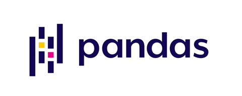
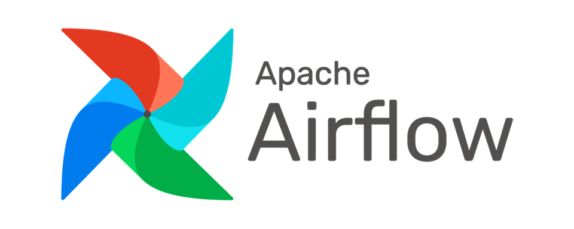
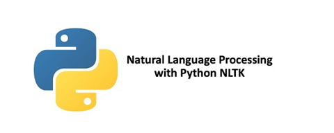

# 

   <h1>  Hola...! Somos la Empresa TECHJOBS INC   </h1>

Somos una empresa líder en análisis de datos, ingeniería de datos y ciencia de datos, que se especializa en ayudar a organizaciones de diversos sectores a aprovechar al máximo sus datos para obtener información significativa en la toma de decisiones estratégicas. Nuestro equipo de expertos en datos combina habilidades técnicas avanzadas con un profundo conocimiento del negocio para ofrecer soluciones personalizadas que impulsen el éxito de nuestros clientes.

# Índice
* [Sistema de Recomendación de Empleos](#Sistema-de-Recomendación-de-Empleos)
  * [Objetivo](#Objetivo )
  * [Objetivos Específicos](#Objetivos-Específicos)
  * [Alcance ](#Alcance)
  * [Justificación ](#Justificación) 
  * [Modelo de Negocio](#Modelo-de-Negocio)
  * [Metodología de Trabajo](#Metodología-de-Trabajo)
  * [Diagrama de Gantt](#Diagrama-de-Gantt)
  * [Tegnologías Utilizadas](#Tegnologías-Utilizadas)
  * [Diagrama Entidad Relación](#Diagrama-Entidad-Relación)
* [Data Engineer](#Data-Engineer)
* [Data Analytics](#Data-Analytics)
* [Machine Learning](#Machine-Learning)
* [Diapositivas-Láminas del Proyecto](#Diapositivas-Láminas-del-Proyecto)
* [Roles](#Roles)
    

# Sistema de Recomendación de Empleos
## Mejorando la Experiencia del Usuario en la busqueda laboral:

## Objetivo 

 Desarrollar un sistema de recomendación de empleos que facilite a los usuarios la búsqueda y selección de trabajos, basándose en sus habilidades, experiencias y preferencias personales.
 [Volver al Índice](#Índice)

## Objetivos Específicos

 * Análisis de Preferencias del Usuario: Recopilar y analizar datos sobre las preferencias y experiencias laborales de los usuarios.
 * Desarrollo del Algoritmo de Recomendación: Utilizar técnicas de procesamiento del lenguaje natural (NLP) y machine learning para desarrollar un algoritmo que sugiera empleos adecuados para cada usuario.
 * Implementación de la Interfaz de Usuario: Diseñar e implementar una interfaz de usuario amigable y accesible utilizando Streamlit, donde los usuarios puedan interactuar con el sistema de recomendación.
 * Integración con Bases de Datos: Utilizar Postgres para almacenar y gestionar datos de usuarios y ofertas de trabajo.
 * Orquestación de Procesos: Implementar Airflow para la orquestación de tareas y el procesamiento eficiente de datos.

 [Volver al Índice](#Índice)

## Alcance 
 El sistema de recomendación estará disponible para usuarios en una plataforma web, accesible desde dispositivos móviles y de escritorio. Incluirá funcionalidades como:

 * Registro y autenticación de usuarios.
 * Perfil de usuario con habilidades y experiencias personalizables.
 * Recomendaciones personalizadas de empleos.
 * Opiniones y valoraciones de usuarios.

### Datos Temporales:
 La recopilación y análisis de datos se centrará en el período de los meses de abril a mayo del 2024. Esto permitirá una comprensión detallada de las tendencias y cambios en el mercado laboral en el transcurso de estos años. Esto irá incrementandose cada mes 

### Usuarios Objetivo:
 Los usuarios objetivo serán aquellos que buscan empleo en Colombia durante el período mencionado. La plataforma estará diseñada para adaptarse a las preferencias y comportamientos específicos de los solicitantes de empleo en esta región.

### Expansión Geográfica:
El proyecto se ejecutará inicialmente en Colombia, abarcando ciudades importantes como Bogotá, Medellín, Cali, Barranquilla, y otras regiones clave.
 [Volver al Índice](#Índice)

## Justificación 
### Oportunidad de Innovación Tecnológica:
 La búsqueda de empleo puede ser una tarea desafiante debido a la gran cantidad de opciones disponibles. Un sistema de recomendación eficiente puede:

 * Ahorrar tiempo a los usuarios al ofrecerles opciones que se ajusten a sus habilidades y preferencias.
 * Aumentar la satisfacción del usuario al recomendar empleos con alta probabilidad de cumplir sus expectativas.
 * Ayudar a las empresas a atraer y retener talento al ser destacadas en las recomendaciones.
 [Volver al Índice](#Índice)

## Modelo de Negocio

### Publicidad para Empresas:
 Permitir que las empresas paguen por publicidad destacada en el sistema. Esto podría incluir destacar sus ofertas de empleo, promociones especiales o eventos de contratación para atraer a nuevos talentos. Pueden pagar una tarifa mensual para aparecer en la parte superior de las recomendaciones y destacar comentarios positivos en su perfil.

### Suscripción Premium:
 Ofrecer funcionalidades adicionales y recomendaciones más precisas para usuarios premium, a cambio de tarifas mensuales.

### Comisiones:
Cobrar comisiones por aplicaciones y contrataciones realizadas a través de la plataforma.

### Venta de Datos Analíticos:
Ofrecer datos agregados y análisis de tendencias a empresas de investigación de mercado, consultoras y profesionales del sector. Garantizar la privacidad de los usuarios al proporcionar datos anonimizados y enfocar en ofrecer información valiosa sobre las preferencias del candidato.
 [Volver al Índice](#Índice)

## Metodología de Trabajo 
### Metodología Scrum
Scrum es un marco ágil que se enfoca en la entrega iterativa y flexible de proyectos. Los roles clave incluyen al Product Owner, quien representa las necesidades del cliente, al Scrum Master, que facilita el proceso, y al Equipo de Desarrollo, encargado de ejecutar el trabajo. Scrum se centra en eventos clave como los Sprints, reuniones de planificación y revisiones, y artefactos como el Product Backlog y el Sprint Backlog para proporcionar transparencia, adaptabilidad y colaboración continua en la gestión de proyectos.
 [Volver al Índice](#Índice)

### DInvestigación y Recolección de Datos:
 Recolección de datos sobre las habilidades y experiencias de los usuarios y características de las ofertas de trabajo.

### Desarrollo del Algoritmo:
 Implementación de técnicas de NLP y machine learning para el desarrollo del algoritmo de recomendación.

### Desarrollo de la Plataforma:
 Uso de Python y Streamlit para el desarrollo de la interfaz de usuario y Postgres para la gestión de datos.

### Implementación de Airflow:
 Configuración de Airflow para la orquestación y automatización de tareas.

### Pruebas y Validación:
 Realización de pruebas para asegurar el funcionamiento correcto del sistema y la precisión de las recomendaciones.

### Despliegue y Mantenimiento:
 Despliegue de la plataforma y realización de mantenimiento continuo para mejoras y actualizaciones.

 [Volver al Índice](#Índice)

## Tecnologías Utilizadas

### ETL
| [Python](https://www.python.org/doc/) | [Pandas](https://pandas.pydata.org/pandas-docs/stable/index.html) | [AirFlow](https://airflow.apache.org/docs/) |
| ------------------------ | ----------------------- | ----------------------- | 
|  |   |  |

### EDA
| [Python](https://www.python.org/doc/) | [Pandas](https://pandas.pydata.org/pandas-docs/stable/index.html) | [NLTK](https://www.nltk.org/) | [Matplotlib](https://matplotlib.org/stable/contents.html) | [Seaborn](https://seaborn.pydata.org/) | 
| ------------------------ | ----------------------- | ----------------------- | ----------------------- | ----------------------- | 
|  |   |   |   |   | 

### Machine Learning
| [Python](https://www.python.org/doc/) | [Pandas](https://pandas.pydata.org/pandas-docs/stable/index.html) | [Scikit Learn](https://scikit-learn.org/stable/) | [GitHub](https://github.com) | [Streamlit](https://docs.streamlit.io/) | [NLTK](https://www.nltk.org/) |
| ------------------------ | ----------------------- | ----------------------- | ----------------------- |----------------------- |----------------------- |
|  |   |  |  |  |  |

### Extra
| [Notion](https://www.notion.so/es-la/) | [Chat GPT](https://chat.openai.com) | [Copilot](https://copilot.microsoft.com) |
| ------------------------ | ----------------------- | ----------------------- |
|  |   |  |

 [Volver al Índice](#Índice)
## Diagrama Entidad Relación

 [Volver al Índice](#Índice)
# [Data Engineer](https://github.com/jrguignan/Proyecto-Nails_Salon-Yelp/tree/main/Data%20Engineer)

## Diagrama ETL

## Tareas
* Se eliminaron valores nulos.
* Se eliminaron valores duplicados.
* Se desanidaron algunas columnas.
* Se realizó corrigio valores de columnas. 
* Se automatizo el etl

## Esquema de Carga Incremental(Airflow)

 [Volver al Índice](#Índice)
# [Data Analytics](https://github.com/jrguignan/Proyecto-Nails_Salon-Yelp/tree/main/Data%20Analytics)

## Dashboard

 [Volver al Índice](#Índice)
# [Machine Learning](https://github.com/jrguignan/Proyecto-Nails_Salon-Yelp/tree/main/Machine%20Learning)

 El núcleo del sistema se basó en 2 etapas:

## Recomendación Usuario-Empleo

 En esta etapa, a partir de sus datos y habilidades , se genera una recomendación de empleo. Esto se realiza a través de un filtrado utilizando las habilidades y preferencias laborales de los usuarios. Para solucionar el problema del cold start, se utiliza un filtrado y se genera una recomendación aleatoria para evitar la repetición de la misma.

## Recomendación Personalizada basada en Contenido

 Utilizando NLTK para el procesamiento de lenguaje natural (NLP), se analiza la descripción del trabajo y las habilidades del usuario para encontrar las mejores opciones laborales. Esto se realiza a través de técnicas de análisis de contenido que permiten identificar coincidencias clave entre las descripciones de los empleos y el perfil del usuario, asegurando recomendaciones altamente relevantes.

## Ventajas
 * Optimización de recursos: El uso de técnicas avanzadas de machine learning permite recomendaciones eficientes y precisas.
 * Menor gasto de infraestructura: La optimización del algoritmo reduce la necesidad de recursos computacionales extensivos.
 * Solución del cold start: Al utilizar recomendaciones aleatorias en combinación con filtrado, se mitiga el problema del cold start.
 * Matriz más pequeña: Al usar categorías en lugar de una tokenización extensa, la matriz resultante es un 96% más pequeña.

## [Sistema de Recomendación](https://machinelearning-proyecto.streamlit.app/)

Funciona ingresando datos personales y habilidades con una sintaxis válida.Te mostrará 10 recomendación de empleo personalizada. 

[Deploy](https://streamlit.app/) en la nube de Steamlit.

[Video](https://drive.google.com/) del sistema implementado en servidor local con Streamlit.

[Datasets](https://drive.google.com/drive/) usados por el modelo.

 [Volver al Índice](#Índice)

# Roles 
* Lider del Proyecto: [Carla](https://www.linkedin.com/). 
* Ingeniería de Datos: [Angel Jaramillo](https://www.linkedin.com/in/angeljarads/) y [Alejandro](https://www.linkedin.com/). 
* Análisis de Datos: [Alejandro](https://www.linkedin.com/) 
* Ingeniería de Apredizaje Automático: [Angel Jaramillo](https://www.linkedin.com/in/angeljarads/). 